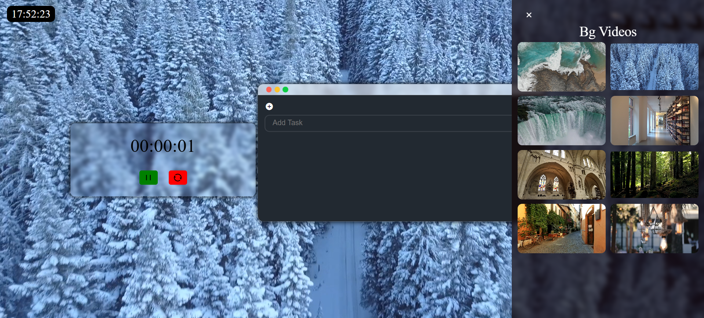

# 🧠 Virtual Study Environment

Welcome to the **Virtual Study Environment** – a focused, interactive digital workspace designed to boost productivity and study effectiveness. Built with a clean and functional UI, this project incorporates tools like draggable components, a Pomodoro timer, and background customization to enhance your workflow.


---

## 📸 Screenshots

 


---

## ✨ Features

- 🎯 **Draggable To-Do Div**: Organize your tasks and notes interactively with draggable UI elements.
- ⏱️ **Pomodoro Timer**: Built-in timer to manage focused study sessions using the Pomodoro technique.
- 🎨 **Dynamic Background Changer**: Personalize your study space by changing the background.
- 📋 **To-Do Tracker**: Maintain a list of study goals and mark them as completed.
- 🗃️ **Database Connectivity**: Store and retrieve task data with Java and JDBC integration.
- 🔐 **Authentication Ready**: Backend setup using Java for scalable user authentication.

---

## 💻 Tech Stack

### Frontend
- HTML5
- CSS3
- JavaScript

### Backend
- Java
- JDBC (Java Database Connectivity)
- SQL (Relational Database for storing to-dos or user data)

---

## ⚙️ How to Run Locally

### 1. Clone the Repo

```bash
git clone https://github.com/Umesh-Tummepalli/virtual-study-environment.git
cd virtual-study-environment
